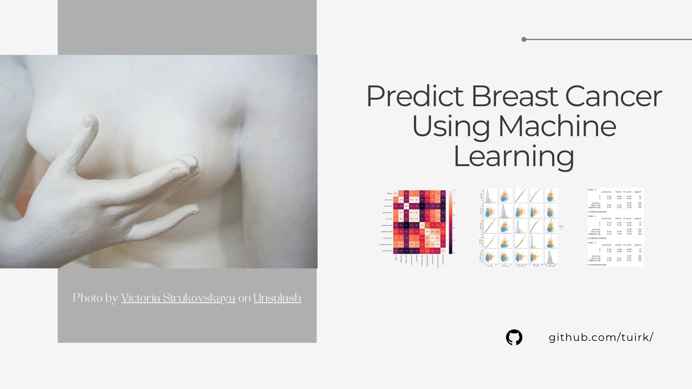

# Predict Breast Cancer Using Machine Learning
Predict Breast Cancer Using Machine Learning - guided project from Udemy

Here is the link to the free course: https://www.udemy.com/course/learn-to-predict-breast-cancer-using-machine-learning-v/ 

This was a free project course aimed to predict breast cancer using machine learning using the Breast Cancer Wisconsin (Diagnostic) data set from Kaggle : https://www.kaggle.com/datasets/uciml/breast-cancer-wisconsin-data

Delivery of the overall course felt a bit messy and as if someone was delivering their course project but it is also great for beginners as it can be used as a guided project. 
